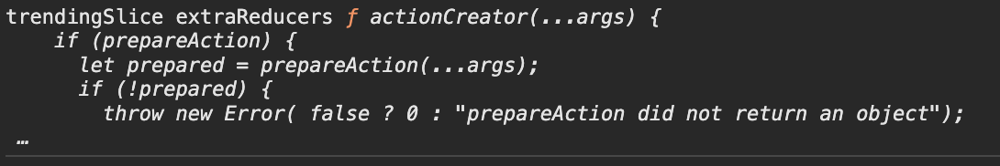
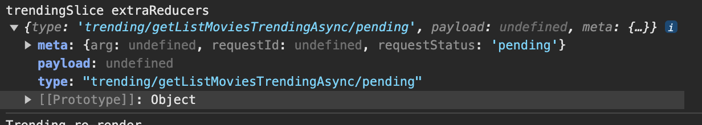
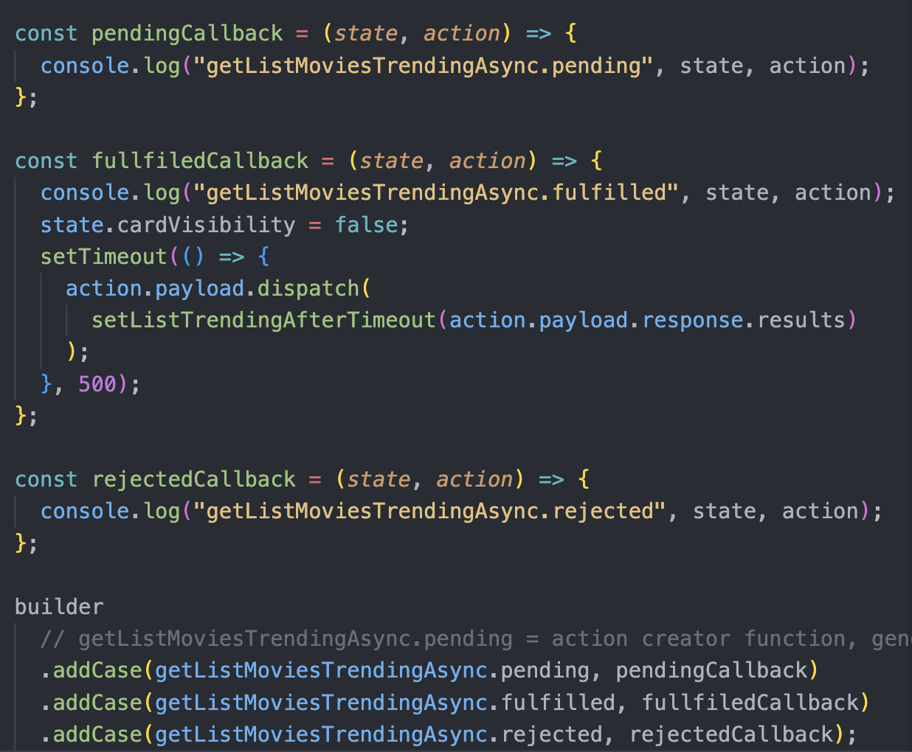
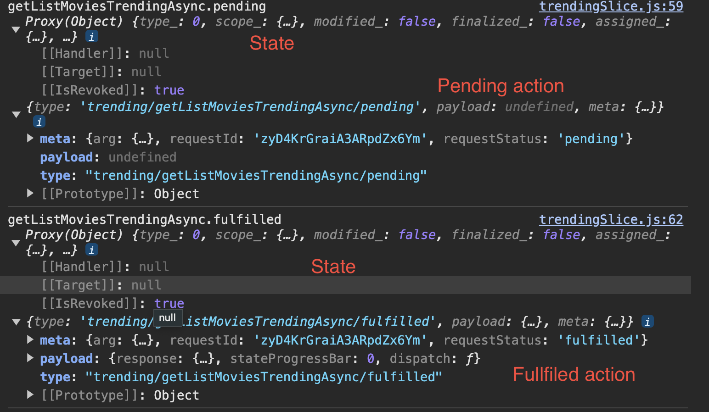
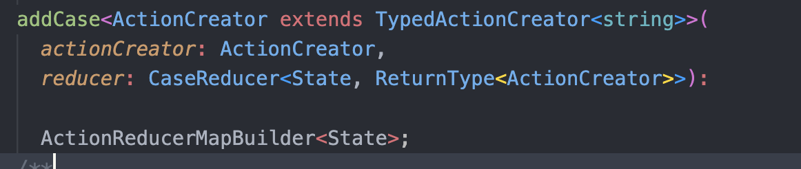
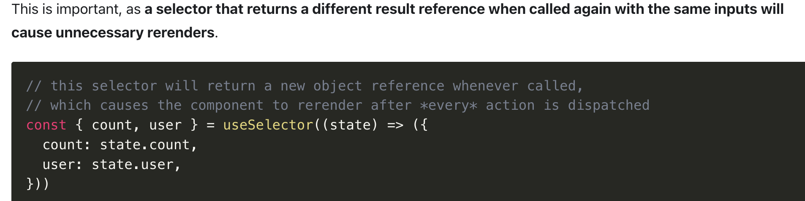
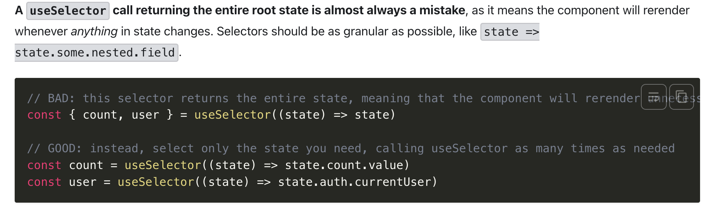
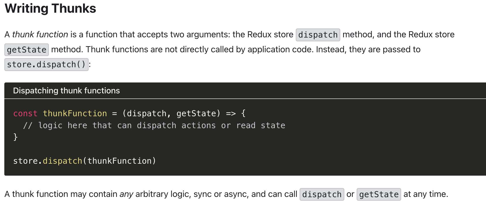
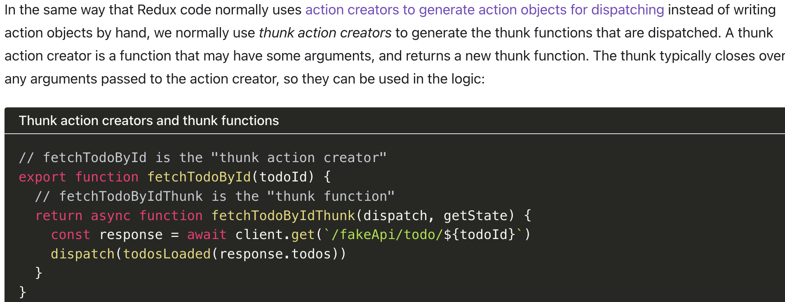

# Getting Started with Create React App

- getListMoviesTrendingAsync.pending --> actionCreator

  - 

- getListMoviesTrendingAsync.pending() --> action

  - 

- actions dispatched by thunk

  - logging 
  - console 

- extraReducers addCase

  - 
  - extraReducers : `ActionReducerMap`

- return new object in selector is cause Component always re-render every action is dispatched
  
- return all state in selector is almost always a mistake, Component will re-render whenever anything in state changes.
  

- thunk function
  

- thunk action creator
  
